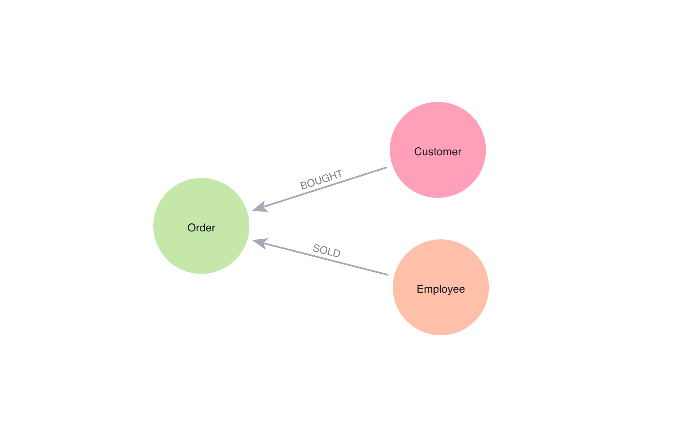

= Coffee shop application with Spring Data Neo4j

This is an example application using Spring Data Neo4j, Neo4j, and coffee shop data.

== Data set

Data is maintained and pulled from a public data source. Originally from a Kaggle repository (unclean), cleaned version available in this repository's load-data.cypher script. An example of the data model is shown below.



For this project, we are focusing on the Order, Customer, and Employee entities and the relationships between them.

== Running and testing this project

To run the application, you will need the following:

* Neo4j database credentials. You can set these in the `application.properties` file or as environment variables on the machine.

Once that's set up and the data imported (copy/paste the load-data.cypher script), execute the application with `./mvnw spring-boot:run`.

You can test the `/orders` endpoint, which retrieves 10 order entities (and their related entities) from Neo4j:

```
http ":8080/orders"
```

*Note:* The above commands are using the https://httpie.io/[
HTTPie^] command line tool, but you can use `curl` similarly.

== Resources
* Site: https://dev.neo4j.com/aura-java[Neo4j Aura^]
* Documentation: https://docs.spring.io/spring-data/neo4j/reference/index.html[Spring Data Neo4j^]
* Online training: https://graphacademy.neo4j.com/[Neo4j GraphAcademy courses^]